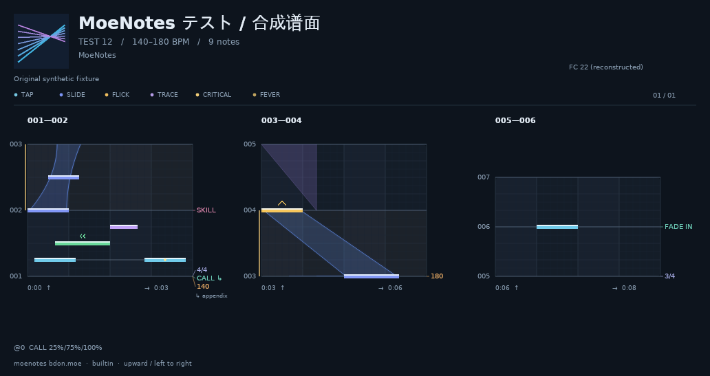

# MoeNotes Chart Renderer

Render a rhythm chart as **one complete multi-column PNG** with cover art, song
title, author credits, difficulty, CJK text and the `moenotes bdon.moe` footer.
The renderer uses Rust, the vendored MoeNotes C17 parser and Skia CPU rendering.

**Artwork is work in progress.** The current visuals are a functional preview,
not the final art direction or a pixel-identical reproduction of the game.



## Quick start

```sh
cargo build --release --locked
cargo run --release -- render tests/fixtures/synthetic.json -o chart.png \
  --metadata tests/fixtures/metadata.json
```

The default binary includes an original built-in skin and licensed fonts. It
needs no APK, Python, prepared game resources or sibling parser repository to
render JSON/gzip charts. Linux needs system C/C++ and Fontconfig/FreeType libraries.
To build on Ubuntu:

```sh
sudo apt-get install build-essential clang libclang-dev libfontconfig1-dev libfreetype6-dev
cargo build --release --locked
```

Rust 1.98.1 and dependency versions are pinned. Skia downloads a supported binary
cache when available; source fallback needs its LLVM, Python and Ninja tools.
The parser is included unchanged at v0.3.0, with recorded upstream hashes and
C/Rust ABI checks. Supported build targets are 64-bit Linux, Windows and macOS;
see [CI](https://github.com/luoxiadesu/moenotes-chart-renderer/actions) for actual
platform status rather than assuming a configured job has passed.

## Render a chart

```sh
moenotes-chart-renderer render chart.json.gz -o chart.png \
  --title '起死開戦' --difficulty EXPERT --level 28 \
  --artist 'millsage' --author 'Music: 藤井健太郎' --cover cover.png

moenotes-chart-renderer render chart.json -o mirrored.png --mirror
moenotes-chart-renderer inspect chart.json -o parsed.json
```

Each chart produces one PNG, with time running upward in each column and columns
read left to right. Columns balance around 24 beats and break at measure boundaries.
There is **no chart pagination**. Oversized requests fail with a scale hint instead
of silently splitting the chart or lowering image quality.

Defaults: 64 px/beat, 10 px/lane, 8 px note body, 10 px arrow height and 2×
supersampling. Auto-spacing can increase beat spacing for dense notes. Options
include `--target-beats`, `--bars-per-column`, `--pixels-per-beat`,
`--pixels-per-lane`, `--note-height`, `--arrow-height`, `--supersample`,
`--fixed-spacing` and `--long` (one tall column). Run `--help` for the interface.

`chart.render.json` records geometry/counts, warnings, image SHA-256 and metadata
provenance. `--scene-json scene.json` writes the scene beside the image.
`--timings` prints parse, scene, render/encode, publication and total seconds.

## Live masterdata and resources

The metadata source is
[StarMoe-org/moenotes-masterdata](https://github.com/StarMoe-org/moenotes-masterdata).
Updates follow its current `main` branch; **the application is not pinned to one
masterdata commit**.

```sh
# Refresh all supported regions once.
python3 scripts/sync_masterdata.py --region all --output data/masterdata

# Or keep following repository updates (60-second polling).
python3 scripts/sync_masterdata.py --region all --output data/masterdata --watch

# Always resolve the selected region's current complete snapshot.
moenotes-chart-renderer render chart.json -o chart.png \
  --masterdata data/masterdata/hk-tw-mo --chart-key 0069/0069_03 \
  --language ja --assets /path/to/by-key
```

Each refresh resolves `main` once, downloads related tables consistently, checks
hashes and atomically advances `current.json`. Failed updates preserve the last
complete snapshot. Commits remain cache/provenance records for reproducibility,
not configured update versions. Rendering reads the current pointer without
making network requests. Stop the watcher normally when it is no longer needed.

Regions: `hk-tw-mo`, `en`, `kr`. Text languages: `ja`, `en`, `zh-Hant`, `zh-Hans`,
`ko`; missing selected text falls back to Japanese. The adapter resolves chart
keys to title, difficulty/level, band/artist, **lyricist, composer, arranger**,
cover key and master FC. An ownerless or ambiguous score row produces an explicit
metadata error instead of inventing a song association.

Covers are read locally from `Image/Jacket/KEY/` in the supplied by-key tree.
This tool does not download or distribute game charts, covers or skin artwork.
Missing requested covers are errors. For another metadata source:

```json
{"title":"Song","difficulty":"EXPERT","level":"28","artist":"Band",
 "author":"Lyrics: A · Music: B · Arrangement: C","cover":"cover.png"}
```

Use `--metadata file.json`; its relative cover path resolves beside that file.
Precedence is explicit CLI fields, then metadata JSON, then masterdata. Without
metadata only the chart filename is used as a title; authors/levels are not guessed.

The default skin is `builtin`. Prepared external game packs are optional:

```sh
moenotes-chart-renderer render chart.json -o chart.png \
  --skin skin001 --packs /path/to/packs
```

Pack lookup uses `--packs`, `MOENOTES_ASSETS_DIR`, assets beside the executable,
its adjacent share directory, then the XDG user data directory. No build-machine
path is used. Skin001/002/003 support zero-tilt parts and separate body/arrow/mark
passes. The source skin002 right-Flick slot `[10,13)` is empty; an explicitly
reported vector fallback is used unless `--strict-assets` is selected.

## Performance

A complete online-masterdata run on Linux/WSL2, i7-11800H, tested all **340 score
rows in each of three regions: 1,020 single-image renders, zero failures**. It used
skin001, cover/credits, default full-quality settings and sequential fresh CLI
processes. The same 340 locally retained chart files were reused across regions.

| Per-chart measurement | Median | P95 | Maximum |
| --- | ---: | ---: | ---: |
| Complete command | 0.736 s | 1.334 s | 2.696 s |
| Drawing + PNG encoding | 0.654 s | 1.252 s | 2.619 s |
| Process peak RSS | 226.8 MiB | 371.9 MiB | 693.8 MiB |

Twelve score rows had no music-owner record and were still rendered with explicit
missing-metadata diagnostics. See [measurement details](docs/PERFORMANCE.md) for
coverage, the initial font failure, timings and reproduction. These are measured
results on one machine, not throughput or cross-platform guarantees.

```sh
python3 scripts/benchmark_masterdata.py \
  --binary target/release/moenotes-chart-renderer \
  --assets /path/to/by-key --packs /path/to/packs --skin skin001 \
  --region all --output output/benchmark
```

## Library and output

`api::Renderer` returns owned PNG bytes and a report without file writes or network
requests. See [API](docs/API.md) and [memory example](examples/memory.rs).
The CLI publishes immutable generations and an atomic `current.json` pointer;
loose PNG/report names are convenience aliases with ordinary-error rollback.
See [output consistency](docs/OUTPUT.md) for crash and retention boundaries.

Source judgement count, derived/skip Combos, reconstructed FC, master FC and
visible glyph count are separate. Master/reconstruction differences warn.
Curves preserve ordered equal-tick transitions and exact column boundaries.
Default `musical` mode uses tick ratios and reflected edge easing; optional
`native-parameters` is a flat parameter study, not game camera/shader emulation.

BPM, meter, Skill, relative Call rhythms and source fade flags are annotated.
Temporal fade behavior and absolute Call schedules are not guessed. Nonmonotonic
lines fail, untested shared graphs retain parser warnings. Complex-script shaping,
SVG/PDF, playback and native pixel equivalence are outside this release.

## Development

Follow [development rules](docs/DEVELOPMENT.md) before commits and pushes:
format, Clippy, tests, docs, release build, synthetic visual checks, code review
and staged secret/file review. [Validation](docs/VALIDATION.md) records boundaries.
All image acceptance tests use complete charts; current visual goldens do not
freeze the final artwork. CI includes native Linux/Windows/macOS checks and
uploads code packages, never game resources. No tag/release is published by a
source push. See [licenses](THIRD_PARTY.md), [security](SECURITY.md) and
[changelog](CHANGELOG.md).
